# Tropical Birds Pairs Memory Game
 
This Tropical Birds Pairs Memory Game was created for the Milestone 2 project of the Level 5 Web Applications Development with Code Insitute The project aim was to Design, develop and implement a dynamic Front end web application using HTML, CSS and JavaScript.

 
 

[View Tropical Birds Game Here](https://louisejones101.github.io/memory-game/)

 

<kbd>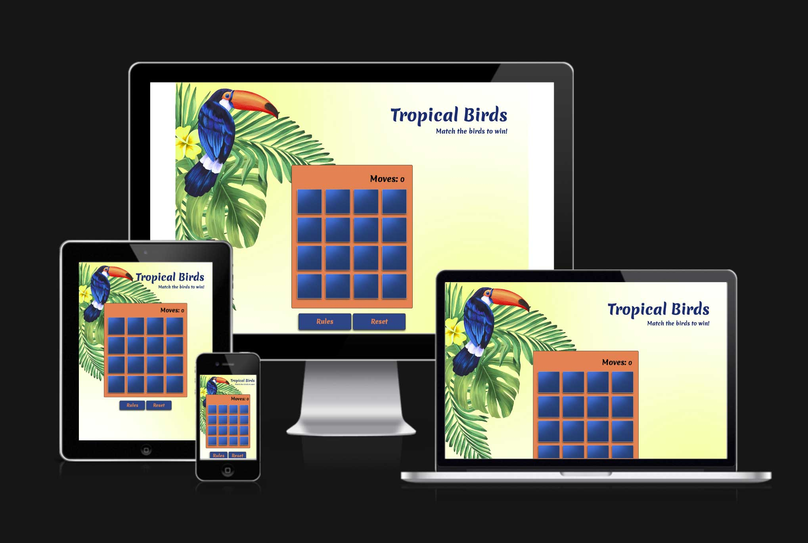</kbd>

 

# Contents
 

* [User Experience (UX)](#user-experience-(ux))
  * [Initial Discussion](#initial-discussion)
  * [User Stories](#user-stories)
  * [Design](#design)
    * [Colour Scheme](#colour-scheme)
    * [Typography](#typography)
    * [Imagery](#imagery)
  * [Wireframes](#wireframes)
  * [Page Features](#page-features)
  * [Accessibility](#accessibility)
  * [Future Implementations](#future-implementations)
* [Technologies](#technologies)
  * [Languages Used](#languages-used)
  * [Fameworks Libraries and Programs Used](#frameworks-libraries-and-programs-used)
* [Testing](#testing)
  * [Accessibility Testing](#accessibility-testing)
  * [Responsiveness](#responsiveness)
  * [Browser Compatibility](#browser-compatibility)
  * [Features](#features)
  * [Testing User Stories](#testing-user-stories)
  * [Lighthouse](#lighthouse)
  * [W3C Validator](#w3c-validator)
  * [W3C Jigsaw](#w3c-jigsaw)
* [Bugs](#bugs)
* [Deployment and Local Development](#deployment-and-local-development)
  * [Deployment Instructions](#deployment)
  * [Local Development](#local-development)
* [Credit Section](#credit-section)
  * [Code Used](#code-used)
  * [Content](#content)
  * [Images](#images)
  * [information](#information)
* [Acknowledgements](#acknowledgments)

 
   

# User Experience (UX) 

 

## Initial Discussion

The Game consists of single home page with a tropical theme where the user tries to match pairs of identical tropical birds.  The aim of the game is to flip two cards over each turn and find the find the matching pairs of images.  

The game consists of a 16 card grid of made up of 4 x 4 tiles. There is a timer, a moves counter, a reset button, and a rules button.   The user will be able to read the rules before using the game if they wish by clicking on the rules button which will create a pop up containing the information.  

The game begins when the user clicks their first card choice which then triggers the timer to start.  The user will only be able to flip one card at a time and only two cards each turn.  If the cards match then they will stay visible on the screen, if not they are both flipped back over and they must click their next choice.  

Once all of the cards have been found the user will get a pop up congratulating them and letting them know how much time the game took them to complete and how many moves. They will have the option to play again and the game will reset.

 

## User Stories

### As a user

*   As a user I want to be able to see clearly on arriving at the site that it is a memory game, with a clear title and layout.  

*   I want to be able to see and understand the rules of the game before I play.

*   I want to be able to click two cards at a time and reveal the cards that I have clicked on.

*   I want the cards to stay revealed if they are a match and flip back over if not.

*   I want to be able to reset the game and the counter if I want to finish it early or start again.  

*   I want to be told when the game has finished. 

*   I want to be offered the opportunity to play again.  

 

## Design

The aim of this project was to build an interactive game that was fun, easy to operate and visually appealing. The game is able to be played by a user of any age.

### Colour Scheme

The color scheme chosen were a vibrant coral, yellow, blues and greens.  The inspiration for the colour palette was taken from the background tropical image that I chose to use.  The colours chosen are bright and colourful. 

The title text, card backs, and buttons are the same colour to match the blue in the toucan.  The coral background of the game grid, was chosen to be similar to the toucans beak colour and matches the modal backgrounds to tie them all togther. The move counter text and the modal text are black so that they are able to be read easily against the coral background.  

The light yellow background was chosen to have a calming effect against the busy game colours and toucan image and help to distinguish between the game grid and the background.  
Below is a screenshot of the colours used.

<kbd>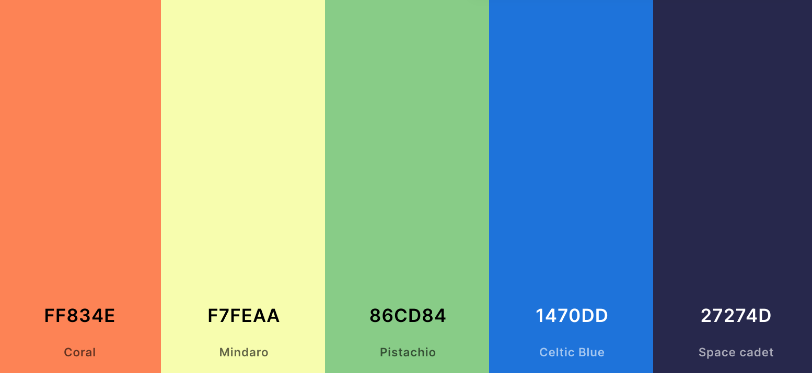</kbd>

 

### Typography

The fonts for this project were imported from Google Fonts, link in the [credit section](#credit-section).  The main font chosen was Merienda which I thought was quite a playful funky font.  For the Modal contents Calibri was used as there was quite alot of text and calibri is easier to read at small sizes than Merienda.  The back up text is San-serif. 

 

| Merienda font | Calibri |             
|--------|--------|
|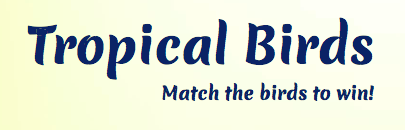|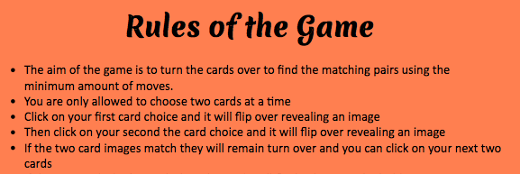

 

### Imagery

The pictures used for his site were sourced from online websites that offer free images (these are listed in the [credit section](#credit-section). The bird images used for the face of the cards were on one sheet and had to be split down to smaller images.  The images were resized using Photoshop and Illustrator.

 

## Wireframes

The wireframes for this project were created by hand on the Ipad in Procreate.

 

### Main page Desktop wireframe

<kbd>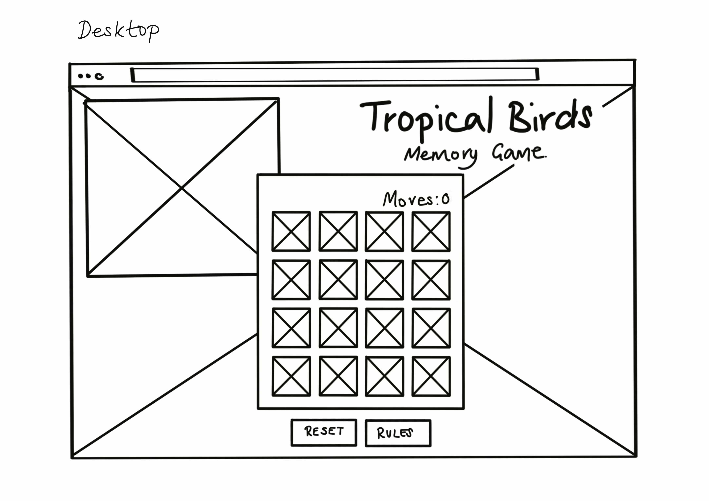</kbd>

 

### Main page tablet device and mobile wireframes

<kbd>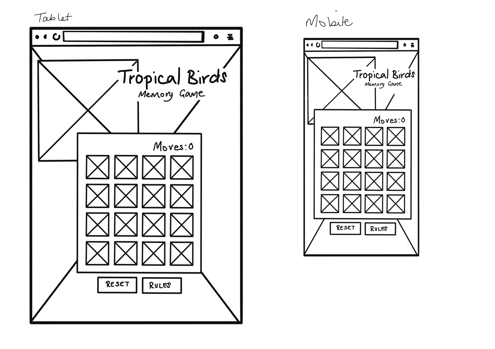</kbd>

 

### Modal wireframes

<kbd>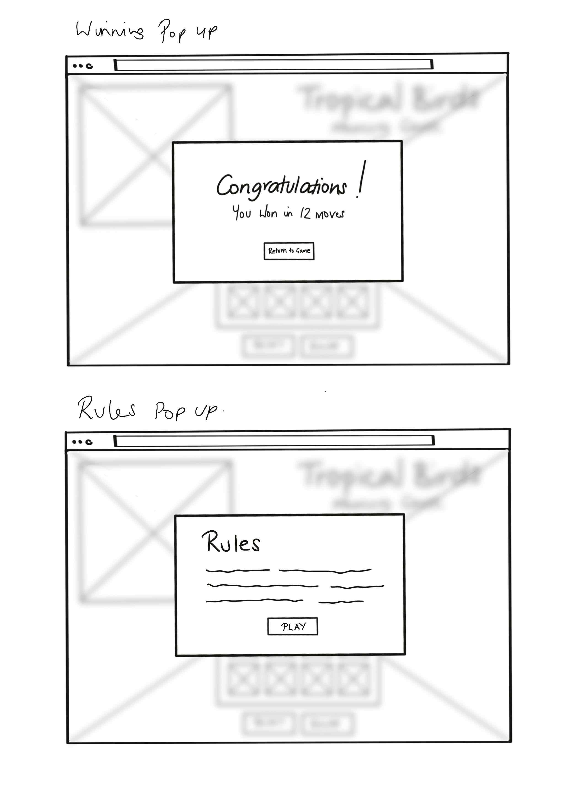</kbd>

 

## Page Features

The website consists of a main game page.  The game page contains the title of the game, the game grid, a background image, a rules button, a reset came button and a move counter.  When the user clicks on the rules button a modal pops up on screen and the user has to click the play Game button in the modal to close the window and begin the game.  

Once the user has successfully matched all the pairs of cards another modal pops up telling the user they have won the game. The user can then click the play again button to return to the game.  All of the cards are reset when the game has been succesfully completed. The cards are flipped back over, the counter is returned to 0 and the cards are shuffled to new positions. 

The cards have a coloured background and then are flipped over to reveal the image.  The buttons change colour when clicked to show that they have been activated.  The modal backgrounds are a slightly translucent black colour to partially hide the screen behind so as not to distracted from the message on the screen.

The site has a favicon as the website icon which was created using the coral and blue colours of the grid and the first letters of the Title.

 

| Game | Game cards flipped |             
|--------|--------|
|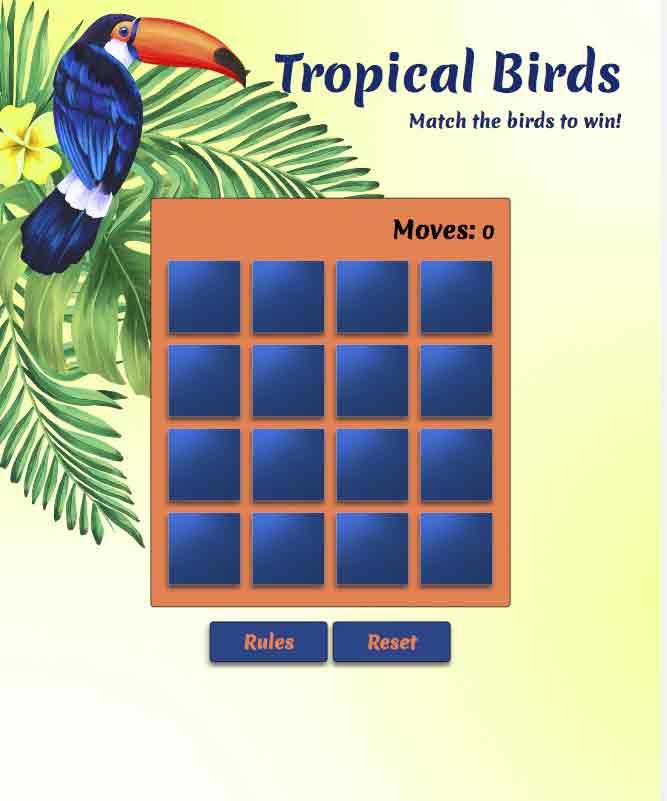|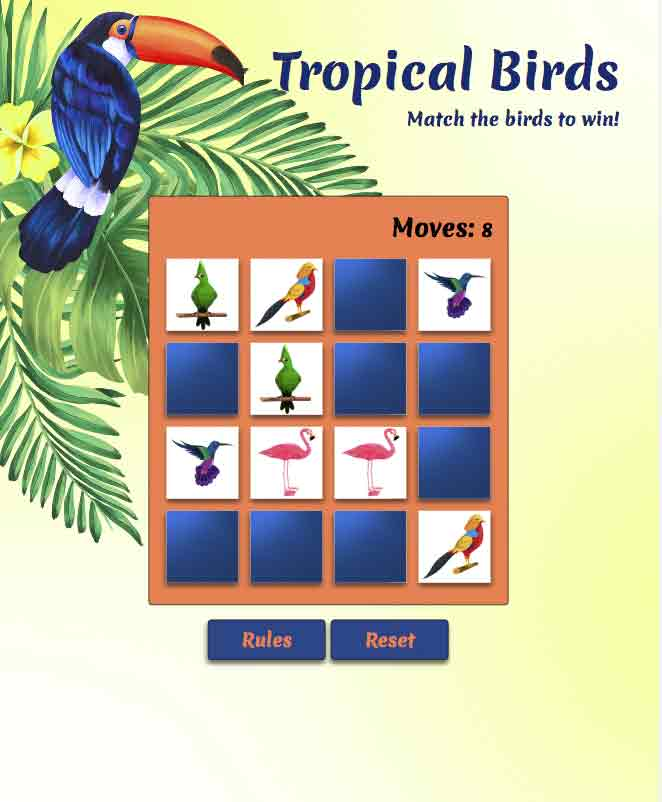|

 

| Rules modal | Win modal |             
|--------|--------|
|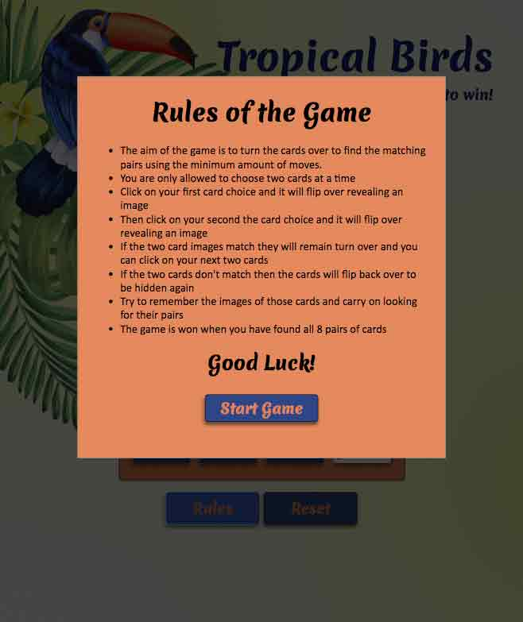|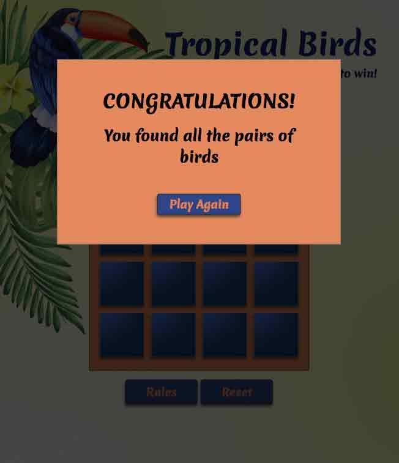|

  

## Accessibility

 

The font families and font size were chosen for their readability.

Colours for the backgrounds and the text where chosen to give as much contrast as possible for users to be able to see the text clearly. During testing using Wave it was highlighted that the images did not contain alt tags.  Discussed below in the testing section.

 

## Future Implementations

As always time restrictions limited the features I would have liked to add to the project.  I originally wanted to add a timer to the game so the user could time their performance, however this was not possible due to my own time restrictions.  

Different levels to move up through that increase in difficulty, with more cards on the grid, faster card flipping times etc.  A login area for users to store their results, and record their scores and progress.

Add in the ability to close the modal pop ups by clicking outside the box to offer an alternative method of closing it.  

 
 

# Technologies

## Languages Used

  HTML, CSS and Javascript

## Fameworks Libraries and Programs Used

  Procreate - used for the wireframes

  Git and Github - for version control, storing of files and deploying the site

  Gitpod - used as the coding environment.

  Google Fonts - used for the Typography on the page.

  favicon.io  - used to generate the favicon for the site

  Google Dev Tools - to test the style features, layout of pages and responsiveness as the site was being built.

  Photoshop and Illustrator - resizing and editing of images

  W3C Markup Validation - to test HTML code

  W3C Jigsaw - to test CSS code

  Wave by Webaim - Used to check the accessibility of the site

  JSHint - to test the JS code

 

# Testing

Throughout the project I used Google Chrome Dev Tools to check the layout and responsiveness.  I regularly tried out the game and tested its features afer making changes.

## Accessibility Testing

In order to test the accessibility of the site I ran the pages through [Wave](https://wave.webaim.org/) to see if there were any issues.

Below shows the some of the things it flagged during the test.  As you can see from the first screenshot below Wave flagged that the images used for the cards didn't have alt tags, the gameGrid was generated in JS using and array for the data but for some reason wave doesnt seem to pick them up.  I did not change anything.  

It also highlighted that I used a 
 tag for the text under the H1 that could have been better suited to a H2 tag.  I was unable to go back in to change this before the submission deadline.

Below is the screenshot showing the results with the img alt tags missing.

 

Screenshot 1
<kbd>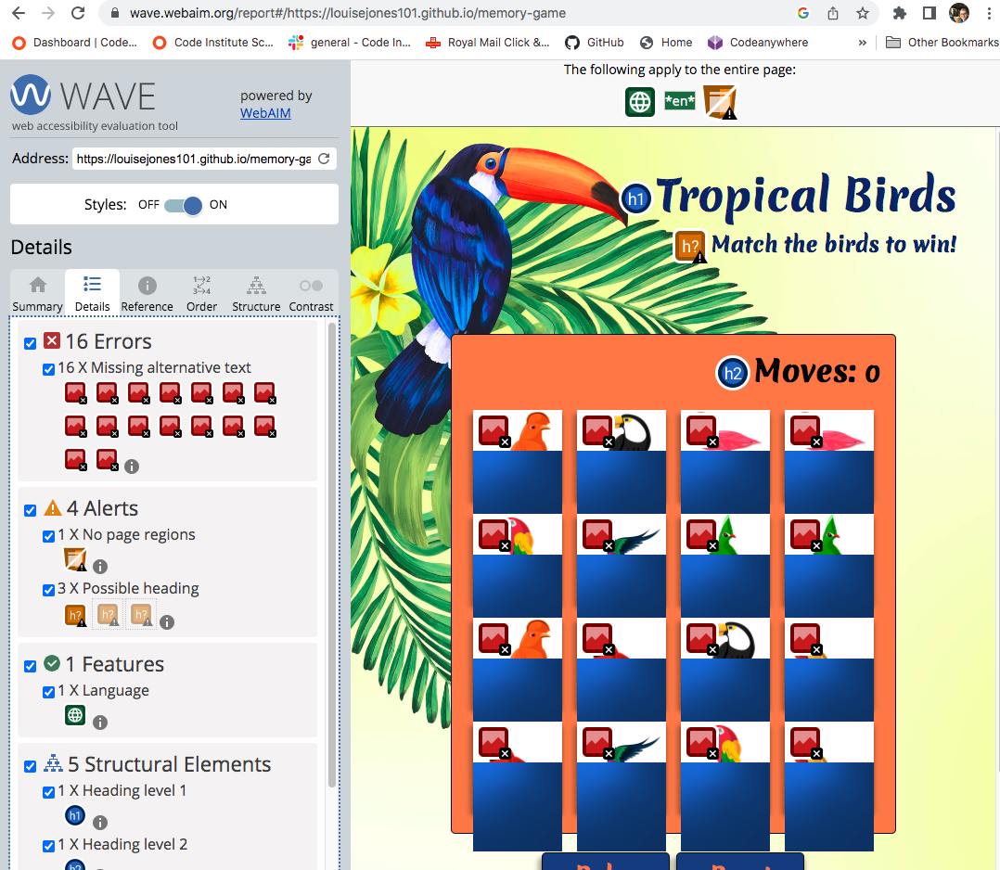</kbd>

 

## Responsiveness

The table below contains responsiveness results for some of the standard devices in the Google Dev Tools options.

 

|Responsiveness|Iphone 8)|Samsung Galaxy S8 (360px)|Ipad Mini (768)|Surface Pro 7 (912px)|Galaxy Fold (280px)|Nest Hub (1024px)|Notes               |
|--------------|-----------------|-------------------------|---------------|---------------------|-------------------|-----------------|--------------------|
|Text scales down as expected|yes|yes|yes|yes|yes|yes|
|Columns align as designed|yes|yes|yes|yes|yes|yes|
|Game grid aligns correctly|yes|yes|yes|yes|yes|yes|
|Modals correct|yes|yes|yes|yes|yes|yes|

 
 

Below are some screenshots of the game on different devices.

|Iphone 6/7/8|Ipad mini|
|-------|----|
|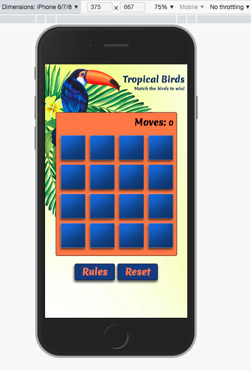|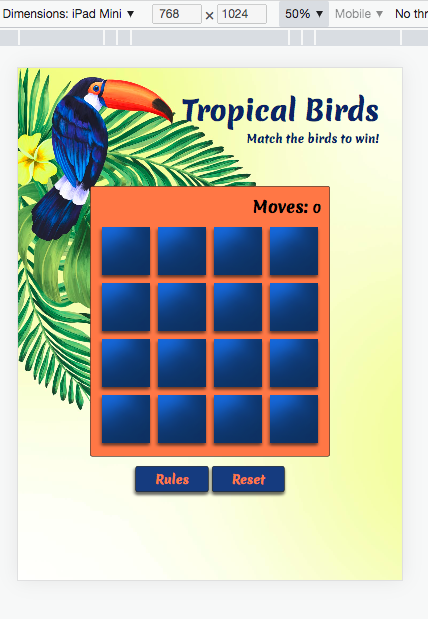|

 

## Browser Compatibility

I tested the game  in three different browsers to check that everything worked, the layout and appearance remained as it should.  The three browsers I chose were the three I had easy access to on my Apple Macbook, Google Chrome, Firefox and Safari.  Everything worked as it should in the three browsers. 

 

|   |Google Chrome|Firefox|Safari|Notes |
|---|-------------|-------|------|------|
|intended appearance|Good|good|good|
|intended responsiveness|Good|Good|good|

 
 

## Features

Throughout the project, everytime a new feature was added to the code I tested the functions etc to make sure that they were workign correctly.  There were some bugs that will be discussed in the Bugs section below.

At the end of the build I manually tested every feature on every page to ensure all the links/buttons/form did as they should.  Below are the results.

 

|Feature|Test|Outcome|
|-------|----|-------|
|Rules Button|Click on|Changes colour when clicked triggers a pop up for the rules|
|Start Game Button|Click on|Closes the rules modal pop up to reveal the game grid|
|Cards flip over|Click on|All cards flip over when clicked to reveal the image|
|Counter increases each turn|Monitor counter|Counter increases correctly when a turn is taken|
|Matched pairs|Find a matching pair|Cards remain flipped over once matched|
|Pointer event disabled on matched cards|Click on matched pairs|Nothing happens when click on a matched card|
|Reset Game Button|Click on|All cards flipped back over to original position.|
|Cards shuffled when game reset|click on cards after reset|Card images are in different positions on the grid|
|Counter resets on reset|observe counter on button click|Counter returns to 0|
|Win modal triggered when game complete|find all the pairs|When all pairs found modal pop appears with win message|
|Play Again Button|Click on|Closes winning modal|
|Game reset after win|Look for signs of reset|Counter reset, cards flipped back over, cards reshuffled|
|Check all features again after game has been won for bugs|Play game and test features again|All working correctly|

 
 

## Testing User Stories

|User Story|Testing|
|-------|----|
|As a user I want to be able to see clearly on arriving at the site that it is a memory game, with a clear title and layout.|You clearly see the title of the game with a headline explaining 'match the pairs'|
|I want to be able to see and understand the rules of the game before I play.|The rules button is clearly visible in button format below the game.  The pop up works and shows the rules in bullet point form|
|I want to be able to click two cards at a time and reveal the cards that I have clicked on.|Two cards can be clicked at a time.  However a glitch was noted (see below)|
|I want the cards to stay revealed if they are a match and flip back over if not.|Cards stay revealed, cards flip back over when no match|
|I want to be able to reset the game and the counter if I want to finish it early or start again.|The counter resets when button clicked, the cards flip back over and the cards are reshuffled| 
|I want to be told when the game has finished.|Pop up saying congratulations when the game has been completed|
|I want to be offered the opportunity to play again.|A button in the win pop up where the user can click to start again|

 
 

## Lighthouse

As part of the testing I used Lighthouse in Google Chrome to test the performance, accessibility, best practices and SEO.  I tested both the desktop and the mobile version.  

Both the desktop and mobile versions had a good scores for best practice, performance and SEO.  The Accessibility score was in the lower 80's due to there not being an img alt tag on the background img for the cards.  The cards were in the CSS file so I could not add alt tags to them.  

Below are screenshots of the results from the lighthouse panel.

 

| Desktop | Mobile |
|------------------------|-----------------------|
|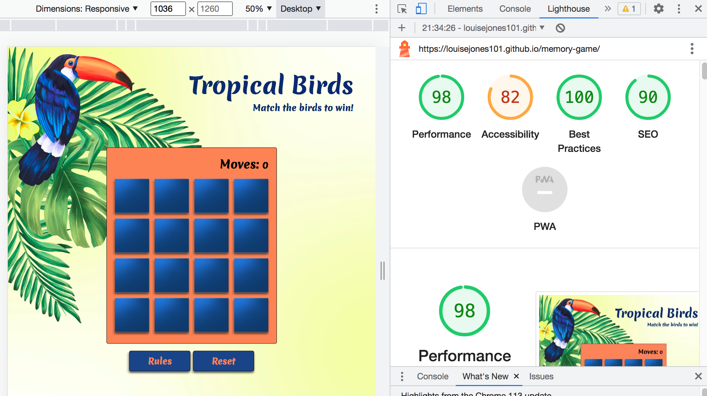|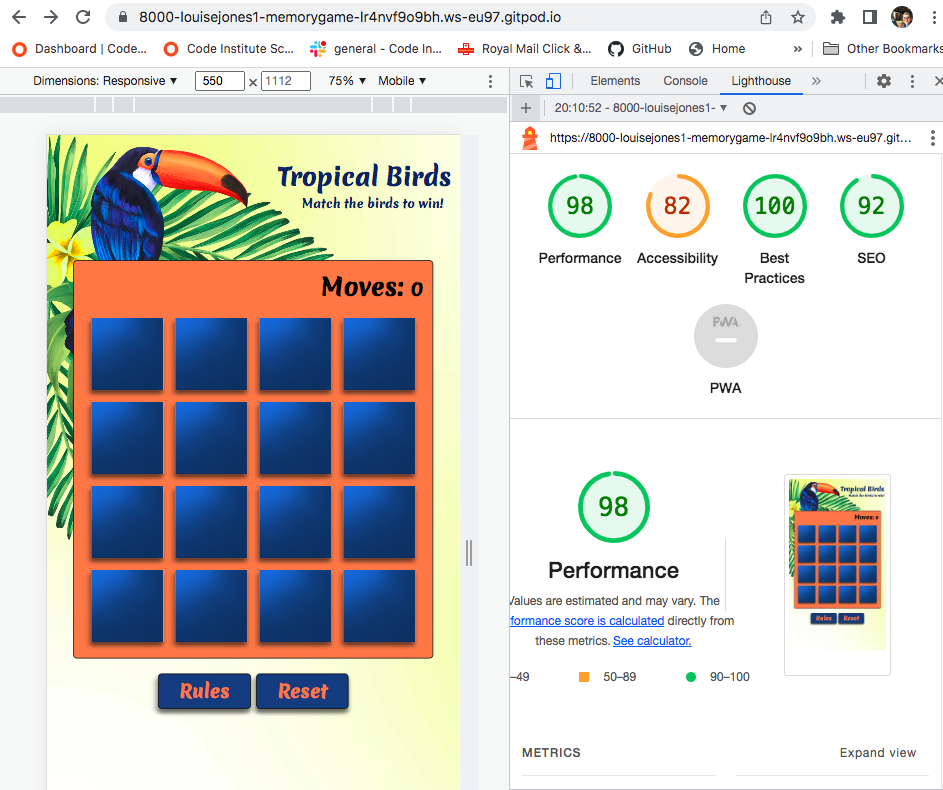|

 
 

## W3 Validator

To test the HTML code in the index.html I run the code through the W3 Validator.  It came back with an error stating that there was a section where a div could be.  So I changed the section to a div and re-run the code through a second time.  There were no errors returned.  Below is a screenshot of the validator result before the changes were made.  

 

| HTML before | HTML after |
|------------------------|-----------------------|
|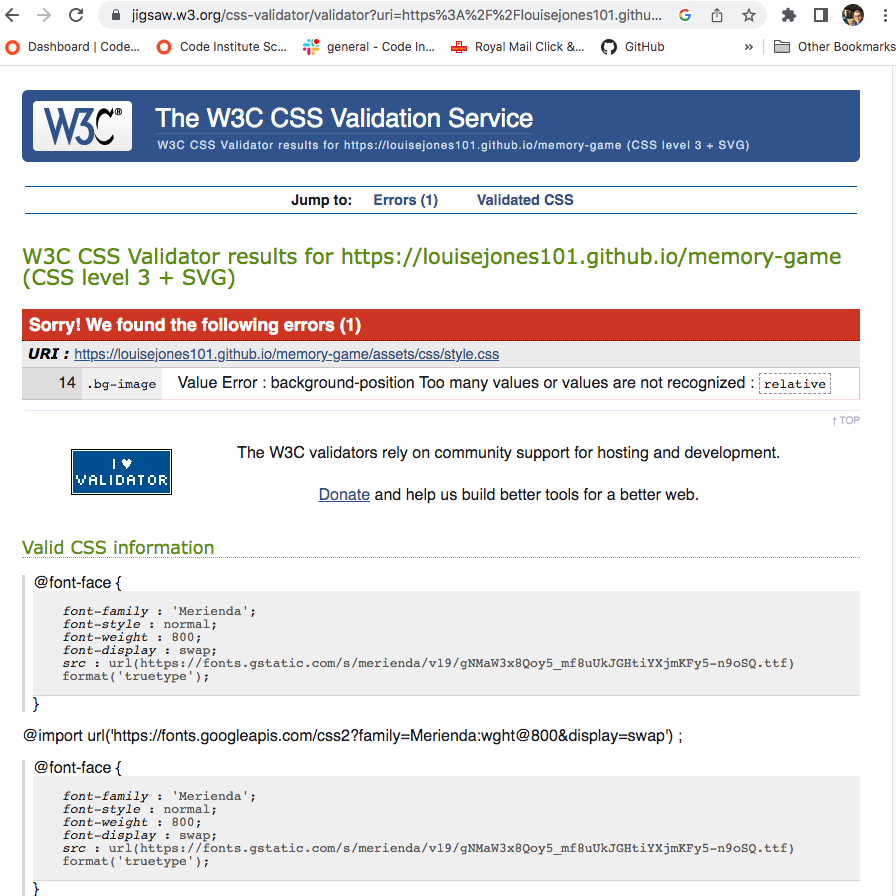|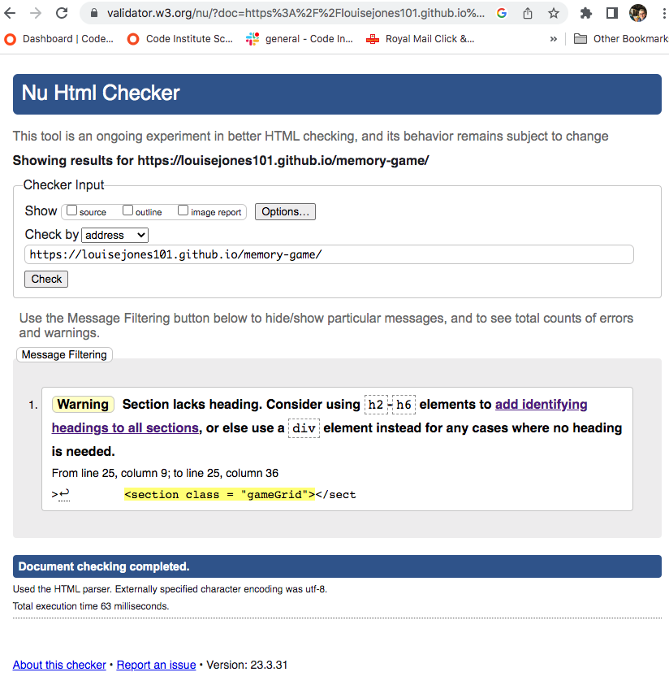|

 
 

## W3C Jigsaw

To check the CSS code I copied and pasted the code into the w3c css validator.  It highlighted one error with a 'unneccesary bg-image position - relative,' which I removed.  After the change had been made in the CSS file, the code was re-run through the validator and came back with no errors.

 

| CSS before | CSS after |
|------------------------|-----------------------|
||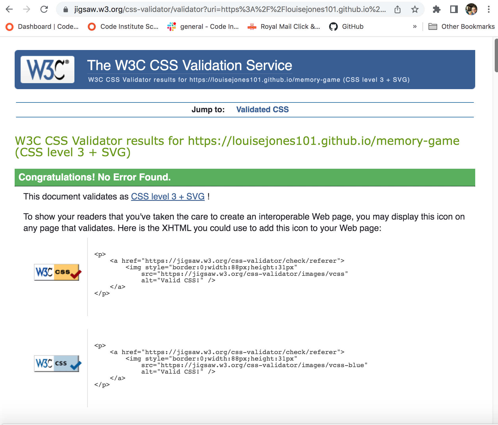|

 
 

## JSHint

To test the JS code I copied and pasted the code into JSHint.  It returned a few errors as you can see in the first image below.  Most of them were simple mistakes that could be changed.  All unnecessary semi-colons, and two unused variables were removed.  Missing semi-colons were added in.  

The remaining corrections it recommended were for 4 undefined variables.  These were the variables used to link to the HMTL document.  Due to time restraints I didnt have time to go back and take a look at them so they were left.  

It also suggested that there were some long functions in there, I did not change these, however for future projects I will used shorter functions.  The code was then run through JSHint again as you can see in the second image below.

 

| JSHint before | JSHint after |
|------------------------|-----------------------|
|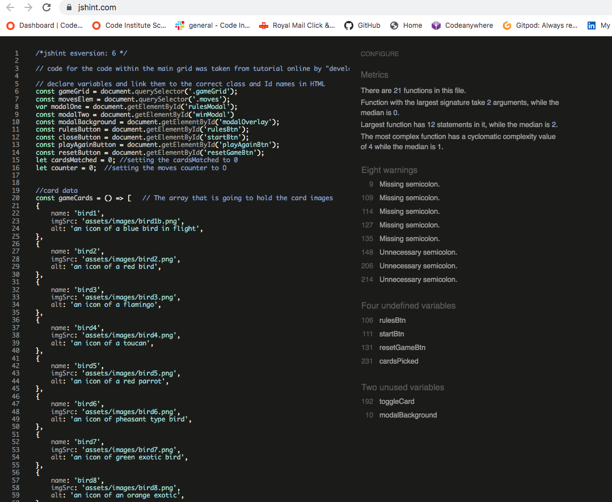|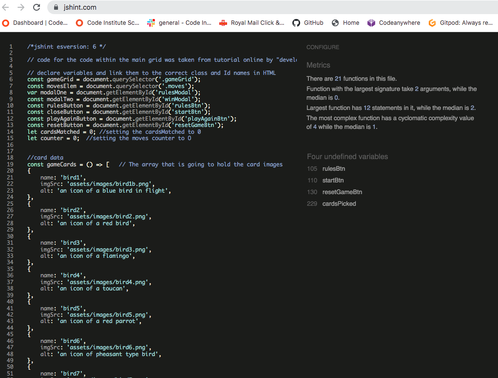|

 
 

# Bugs

I have been testing throughout the build using Google dev tools and fixing problems as they arose.  

One of the bugs was that the images were not resizing properly in the grid and they overflowing out of the card container.  This was corrected by setting the card container size and then setting the image size to 100%.  

One big bug that I encountered was concerning the perspective function linked to the preserve-3d styling.  When you clicked on a card part of the other neighbouring cards were revealed.  I checked the grid container measurements in dev tools, the layout, card sized, and then realised that the flip function may be to blame. After removing the perspective and then re-adding it, it became clear that this was the problem, I removed it as it didnt impact to much the way the cards looked as they flipped. counter not resetting.   

I could not get the if statement that was used to check if the cardsPicked was equal 16 then pop up activated. In the end I created a new variable called cardsMatched and then called it in the if statement.  If the cards picked were equal to two then the cardsMatched increased by one.  Then I created an if statement to check if the cardsMatched were equal to 16 it triggered the win message.

This last thing isnt a bug of sorts as I haven't created the code yet.  But I realised towards the end of the project that the user is able to click on the other cards before their chosen two cards have flipped back over.  I would like to build a function that removes the pointer events on the cards are temporarily deactivated whilst the check match function is running and the cards are being flipped back.

 
 

# Deployment and Local Development

## Deployment Instructions

The site is deployed using GitHub pages

To deploy the site:-

1.  Log in or sign up to Github
2.  Click on the respository name
3.  Click on settings
4.  Find Pages on the lefthand side menu and click
5.  Scroll to Build and Deployment section
6.  Make sure the Deploy from a branch is selected in the Source box
7.  In the Branch dropdown menu select Main and root and then save.

You will then see a notification at the top of the page to say that the site is live and a link to visit the site.  This may take a few minutes.

 

## Local Development

How to fork the respository:-

1.  Log in or sign up to Github
2.  Click on the respository name
3.  Click on Fork in the top-right hand corner of the page
4.  Select the owner of the respository
5.  Add a description of your fork (optional)
6.  Copy the main branch only (default)
7.  Click on the create Fork button

 

How to clone the repository:-

1.  Log in or sign up to Github
2.  Click on the Code button above the list of files
3.  Copy the repository URL
4.  Open the terminal
5.  Change the working directory to where you want to put the cloned directory
6.  Type 'git clone' and then add the URL
7.  Press enter

 
 

# Credit Section

## Code Used

YouTube tutorial by "DevelopedByEd' - Awesome Vanilla JavaScript Memory Card Game Tutorial"  https://www.youtube.com/watch?v=-tlb4tv4mC4 - I followed this tutorial to build the main grid of the game and the flip functions.  The main game container, grid and cards code was used and edited to fit what I wanted.  

W3 Schools - How to make a modal box with CSS.  https://www.w3schools.com/howto/howto_css_modals.asp  - I used some of the CSS styling from this example for my modal background to get the partly transparent overlay, I edited to suit my project.

w3schools for general code ideas

Stack overflow - when having problems with any bit of code then this channel used to look at different answers given.

 

## Content
  
Am I responsive - (https://ui.dev/amiresponsive)

Colour palette generator - coolors - (https://coolors.co/22292f-035746-caa59b-fcf8cf)

 

## Images

The Bird images for the card faces were taken from this free download on freepik by macrovector. - 
 https://www.freepik.com/free-vector/exotic-birds-set_3817867.htm#query=jungle%20birds&position=9&from_view=search&track=ais

The background was made up from part of a tropical background image by BiZkettE1 which I downloaded from freepik.  The file was a psd file with layers so I was able to change the image around, delete and resize some of the features to suit what I wanted. - https://www.freepik.com/free-psd/colorful-summer-nights-poster-template-with-toucan_4793703.htm#page=2&position=11&from_view=author

The blue gradient background card image was created by myself in photoshop.

 

| birds | background |             
|--------|--------|
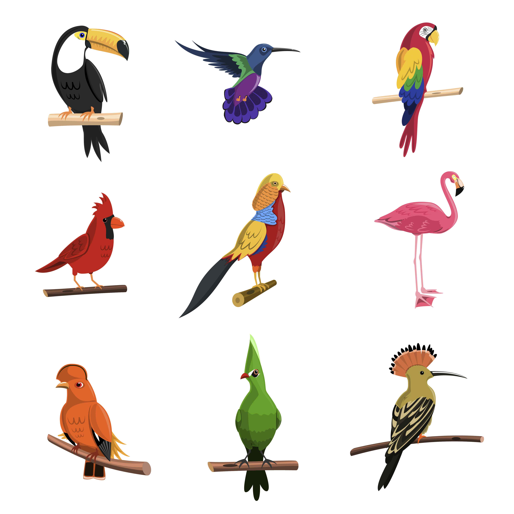|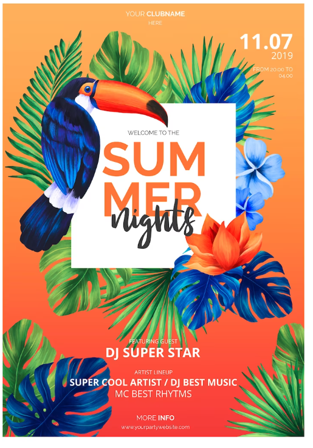|

 

## information

During this project I researche how to code with javascript, watching tutorials and looking at examples on various sites.  Below is a list of the sources that I used to find the answers to questions that arised.  

W3schools - modals, grids
Stack Overflow - used to look for answers whilst debugging issues

Youtube tutorials on building javascript games - main tutorial was by 'DevelopedByEd' which I followed along with as I was coding.  I used his code to build the main grid of the game, the cards, the flipped feature etc, and then changed, removed and added code and features to suit my design.  

I also watched the tutorial by Ania Kubów on Youtube which helped me to understand the structure of building a memory game and using arrays.  - Make MEMORY GAME in JavaScript, HTML and CSS for your portfolio, by Ania Kubów.

Code Institute - Slack Community - for updates on github and the IDE's.

How to Create a Memory Game in JavaScript, by Ferenc Almasi -  https://webtips.dev/memory-game-in-javascript

 
 

# Acknowledgements

My mentor Elaine Roche for answering all my questions. She is a star.
Student support and Iris the cohort facilitator for checking in on me.
Gemma at Tutor support for giving me advice on why a part of my code wasnt working after spending hours trying all different ways to fix it.

