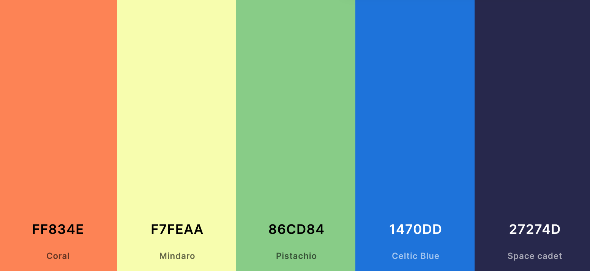

# Tropical Birds Pairs Memory Game
 
This Tropical Birds Pairs Memory Game was created for the Milestone 2 project of the Level 5 Web Applications Development with Code Insitute The project aim was to Design, develop and implement a dynamic Front end web application using HTML, CSS and JavaScript.

 
 

[View the Game here]

 

<kbd></kbd>

 

# Contents
 

* [User Experience (UX)](#user-experience-(ux))
  * [Initial Discussion](#initial-discussion)
  * [User Stories](#user-stories)
  * [Design](#design)
    * [Colour Scheme](#colour-scheme)
    * [Typography](#typography)
    * [Imagery](#imagery)
  * [Wireframes](#wireframes)
  * [Page Features](#page-features)
  * [Accessibility](#accessibility)
  * [Future Implementations](#future-implementations)
* [Technologies](#technologies)
  * [Languages Used](#languages-used)
  * [Fameworks Libraries and Programs Used](#frameworks-libraries-and-programs-used)
* [Testing](#testing)
  * [Accessibility Testing](#accessibility-testing)
  * [Responsiveness](#responsiveness)
  * [Browser Compatibility](#browser-compatibility)
  * [Features](#features)
  * [Testing User Stories](#testing-user-stories)
  * [Lighthouse](#lighthouse)
  * [W3C Validator](#w3c-validator)
  * [W3C Jigsaw](#w3c-jigsaw)
* [Bugs](#bugs)
* [Deployment and Local Development](#deployment-and-local-development)
  * [Deployment Instructions](#deployment)
  * [Local Development](#local-development)
* [Credit Section](#credit-section)
  * [Code Used](#code-used)
  * [Content](#content)
  * [Images](#images)
  * [information](#information)
* [Acknowledgements](#acknowledgments)

 
   

# User Experience (UX) 

 

## Initial Discussion

The Game consists of single home page with a tropical theme where the user tries to match pairs of identical tropical birds.  The aim of the game is to flip two cards over each turn and find the find the matching pairs of images.  

The game consists of a 16 card grid of made up of 4 x 4 tiles. There is a timer, a moves counter, a reset button, and a rules button.   The user will be able to read the rules before using the game if they wish by clicking on the rules button which will create a pop up containing the information.  

The game begins when the user clicks their first card choice which then triggers the timer to start.  The user will only be able to flip one card at a time and only two cards each turn.  If the cards match then they will stay visible on the screen, if not they are both flipped back over and they must click their next choice.  

Once all of the cards have been found the user will get a pop up congratulating them and letting them know how much time the game took them to complete and how many moves. They will have the option to play again and the game will reset.

 

## User Stories

### As a user

*   As a user I want to be able to see clearly on arriving at the site that it is a memory game, with a clear title and layout.  

*   I want to be able to see and understand the rules of the game before I play.

*   I want to be able to reset the game and timer mid game if I want to finish it early or start again.  

*   I want to be told when the game has finished, and find out how much time I took and how many moves I made.

*   I want to be offered the opportunity to play again.  

 

## Design

### Colour Scheme

The color scheme chosen were greens blues and vibrant coral.  The inspiration for the colour palette was taken from the background tropical image that I chose to use.  The colours chosen are bright and colourful.  

Below is a screenshot of the colours used.

<kbd></kbd>

 

<kbd><i""  width="800"></kbd>

 

### Typography

The fonts for this project were imported from Google Fonts (link in credits).  The fonts chosen were ....  All three of these fonts are easy to read and spaced nicely. 

 

Future implementations - log in, record scores.  